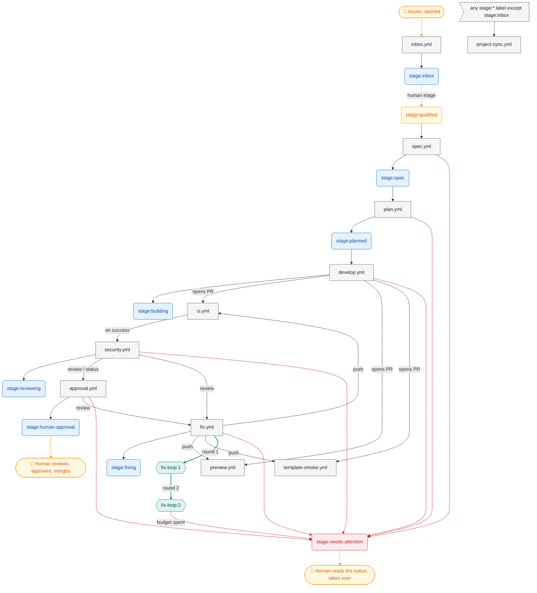

# Pipeline map

<!-- Generated by tools/pipeline-map, do not edit by hand. -->

> Generated by `tools/pipeline-map`, do not edit by hand. Regenerate with `pnpm pipeline:map`; `pnpm verify` fails when this file is stale.

Every path through the issue → PR pipeline, derived from `.github/workflows/*.yml` and the `STAGES`, `MARKERS`, `FIX_LOOP_*` and `COMMAND_EFFECTS` exports of `.github/scripts/pipeline-lib.mjs`. The prose lives in [pipeline.md](pipeline.md).

## Map

Blue: stage labels. Grey: workflows; an arrow from a label into a workflow is its label gate. Red, dashed: escalations to a problem stage. Amber: humans. Teal: the fix loop.

Not on the map, because no pipeline step or label leads to them: `deploy.yml`, `done.yml`. See the table.

## Workflows

| Workflow             | Trigger                                                         | Gate (job `if:`)                   | Stages set                                                   | Comment markers                          |
| -------------------- | --------------------------------------------------------------- | ---------------------------------- | ------------------------------------------------------------ | ---------------------------------------- |
| `approval.yml`       | `pull_request_review: submitted`, `status`, `workflow_dispatch` | status `pipeline/security`         | `stage:human-approval`, `stage:needs-attention` (escalation) | `humanApproval`, `notice`, `state`       |
| `ci.yml`             | `pull_request`, `workflow_call`, `workflow_dispatch`            | -                                  | -                                                            | -                                        |
| `deploy.yml`         | `push: branches main`, `workflow_dispatch`                      | -                                  | -                                                            | -                                        |
| `develop.yml`        | `issues: labeled`                                               | `stage:planned`                    | `stage:building`, `stage:needs-attention` (escalation)       | `notice`, `state`                        |
| `done.yml`           | `pull_request: closed`                                          | -                                  | -                                                            | -                                        |
| `fix.yml`            | `pull_request_review: submitted`, `workflow_dispatch`           | -                                  | `stage:fixing`, `stage:needs-attention` (escalation)         | `fixReply`, `notice`, `state`            |
| `inbox.yml`          | `issues: opened`                                                | -                                  | `stage:inbox`                                                | -                                        |
| `plan.yml`           | `issues: labeled`                                               | `stage:spec`                       | `stage:planned`, `stage:needs-attention` (escalation)        | `notice`, `plan`                         |
| `preview.yml`        | `pull_request: opened/synchronize/reopened/closed`              | -                                  | -                                                            | `preview`                                |
| `project-sync.yml`   | `issues: labeled`, `pull_request: labeled`                      | any `stage:*` except `stage:inbox` | -                                                            | -                                        |
| `security.yml`       | `workflow_run: CI completed`                                    | run `success`                      | `stage:reviewing`, `stage:needs-attention` (escalation)      | `actionable`, `notice`, `securityReview` |
| `spec.yml`           | `issues: labeled`                                               | `stage:qualified`                  | `stage:spec`, `stage:needs-attention` (escalation)           | `notice`, `spec`                         |
| `template-smoke.yml` | `pull_request`, `workflow_dispatch`                             | -                                  | -                                                            | -                                        |

## Comment markers

| Marker                             | Key              | Written by (workflow, `pipeline.mjs` command)                                                                                                                                                                 |
| ---------------------------------- | ---------------- | ------------------------------------------------------------------------------------------------------------------------------------------------------------------------------------------------------------- |
| `<!-- pipeline:actionable -->`     | `actionable`     | `security.yml` (`security-publish`)                                                                                                                                                                           |
| `<!-- pipeline:fix-reply -->`      | `fixReply`       | `fix.yml` (`fix-reply`)                                                                                                                                                                                       |
| `<!-- pipeline:human-approval -->` | `humanApproval`  | `approval.yml` (`approval`)                                                                                                                                                                                   |
| `<!-- pipeline:notice -->`         | `notice`         | `approval.yml` (`approval`), `develop.yml` (`upsert-comment`), `fix.yml` (`fix-adapter`, `upsert-comment`), `plan.yml` (`upsert-comment`), `security.yml` (`security-publish`), `spec.yml` (`upsert-comment`) |
| `<!-- pipeline:plan -->`           | `plan`           | `plan.yml` (`upsert-comment`)                                                                                                                                                                                 |
| `<!-- pipeline:preview -->`        | `preview`        | `preview.yml` (`upsert-comment`)                                                                                                                                                                              |
| `pipeline:security-review`         | `securityReview` | `security.yml` (`security-publish`)                                                                                                                                                                           |
| `<!-- pipeline:spec -->`           | `spec`           | `spec.yml` (`upsert-comment`)                                                                                                                                                                                 |
| `<!-- pipeline-state -->`          | `state`          | `approval.yml` (`approval`), `develop.yml` (`init-state`), `fix.yml` (`fix-adapter`)                                                                                                                          |

## Stages with no label gate, by design

From `EXPECTED_UNGATED` in `tools/pipeline-map/src/config.mjs`.

| Stage                   | Kind   | Why nothing is gated on it                                      |
| ----------------------- | ------ | --------------------------------------------------------------- |
| `stage:building`        | event  | opening the PR (not the label) starts CI and the preview        |
| `stage:fixing`          | event  | the fix push re-runs CI, which restarts the review              |
| `stage:human-approval`  | human  | a human reviews the PR and the preview, approves and merges     |
| `stage:inbox`           | triage | waits for a human to triage the issue and add `stage:qualified` |
| `stage:needs-attention` | human  | the pipeline stopped; a human reads the notice and takes over   |
| `stage:reviewing`       | event  | the review and commit status it posts drive the next step       |

## Findings

- `<!-- pipeline:notice -->` is written by 6 workflows: `approval.yml`, `develop.yml`, `fix.yml`, `plan.yml`, `security.yml`, `spec.yml`.
- `<!-- pipeline-state -->` is written by 3 workflows: `approval.yml`, `develop.yml`, `fix.yml`.
- `stage:qualified` is never set by a workflow (a human adds it; it starts the pipeline).
- Every stage that is set is either gated or listed in `EXPECTED_UNGATED`.
- 6 workflows escalate straight to `stage:needs-attention`: `approval.yml`, `develop.yml`, `fix.yml`, `plan.yml`, `security.yml`, `spec.yml`.
