# Pipeline map

<!-- Generated by tools/pipeline-map, do not edit by hand. -->

> Generated by `tools/pipeline-map`, do not edit by hand. Regenerate with `pnpm pipeline:map`; `pnpm verify` fails when this file is stale.

Every path through the issue → PR pipeline, derived from `.github/workflows/*.yml` and the `STAGES`, `MARKERS`, `FIX_LOOP_*` and `COMMAND_EFFECTS` exports of `.github/scripts/pipeline-lib.mjs`. The prose lives in [pipeline.md](pipeline.md).

## Map

Blue: stage labels. Grey: workflows; an arrow from a label into a workflow is its label gate. Red, dashed: escalations to a problem stage. Amber: humans. Teal: the fix loop.

Not on the map, because no pipeline step or label leads to them: `deploy.yml`. See the table.

```mermaid
flowchart TD
  g_project_sync_stage_>"any stage:* label except stage:inbox"]
  g_restart_stage_>"any stage:* label except stage:needs-attention"]
  h_src_inbox(["👤 issues: opened"])
  h_stage_awaiting_approval(["👤 Owner approves or rejects the protected changes"])
  h_stage_human_approval(["👤 Human reviews, approves, merges"])
  h_stage_needs_attention(["👤 Human reads the hand-off, takes over"])
  l_fix_loop_1{{"fix-loop:1"}}
  l_fix_loop_2{{"fix-loop:2"}}
  s_stage_awaiting_approval("stage:awaiting-approval")
  s_stage_building("stage:building")
  s_stage_done("stage:done")
  s_stage_fixing("stage:fixing")
  s_stage_human_approval("stage:human-approval")
  s_stage_inbox("stage:inbox")
  s_stage_needs_attention("stage:needs-attention")
  s_stage_planned("stage:planned")
  s_stage_qualified("stage:qualified")
  s_stage_reviewing("stage:reviewing")
  s_stage_routing("stage:routing")
  w_approval["approval.yml"]
  w_ci["ci.yml"]
  w_develop["develop.yml"]
  w_disposition["disposition.yml"]
  w_done["done.yml"]
  w_fix["fix.yml"]
  w_inbox["inbox.yml"]
  w_plan["plan.yml"]
  w_preview["preview.yml"]
  w_project_sync["project-sync.yml"]
  w_protected_approve["protected-approve.yml"]
  w_restart["restart.yml"]
  w_router["router.yml"]
  w_security["security.yml"]
  w_template_smoke["template-smoke.yml"]
  h_src_inbox --> w_inbox
  s_stage_awaiting_approval --> h_stage_awaiting_approval
  s_stage_human_approval --> h_stage_human_approval
  s_stage_inbox -->|"human triage"| s_stage_qualified
  s_stage_needs_attention --> h_stage_needs_attention
  g_project_sync_stage_ --> w_project_sync
  g_restart_stage_ --> w_restart
  s_stage_done --> w_project_sync
  s_stage_needs_attention --> w_restart
  s_stage_planned --> w_develop
  s_stage_qualified --> w_plan
  s_stage_routing --> w_router
  w_approval --> s_stage_human_approval
  w_develop --> s_stage_awaiting_approval
  w_develop --> s_stage_building
  w_done --> s_stage_done
  w_fix --> s_stage_fixing
  w_inbox --> s_stage_inbox
  w_plan --> s_stage_planned
  w_protected_approve --> s_stage_awaiting_approval
  w_protected_approve --> s_stage_building
  w_restart --> s_stage_fixing
  w_restart --> s_stage_planned
  w_restart --> s_stage_qualified
  w_router --> s_stage_fixing
  w_router --> s_stage_planned
  w_router --> s_stage_qualified
  w_security --> s_stage_reviewing
  h_stage_awaiting_approval -->|"/approve-protected"| w_approval
  h_stage_awaiting_approval -->|"/approve-protected"| w_disposition
  h_stage_awaiting_approval -->|"/approve-protected"| w_protected_approve
  h_stage_awaiting_approval -->|"/approve-protected"| w_restart
  h_stage_human_approval -->|"merges / closes PR"| w_done
  h_stage_human_approval -->|"merges / closes PR"| w_preview
  w_approval -->|"review"| w_fix
  w_ci -->|"workflow_run"| w_approval
  w_ci -->|"workflow_run"| w_protected_approve
  w_ci -->|"on failure/success"| w_security
  w_develop -->|"opens PR"| w_ci
  w_develop -->|"opens PR"| w_preview
  w_develop -->|"opens PR"| w_template_smoke
  w_disposition -->|"issue_comment"| w_approval
  w_disposition -->|"issue_comment"| w_protected_approve
  w_disposition -->|"issue_comment"| w_restart
  w_fix -->|"push"| w_ci
  w_fix -->|"push"| w_preview
  w_fix -->|"push"| w_template_smoke
  w_protected_approve -->|"issue_comment"| w_approval
  w_protected_approve -->|"opens PR"| w_ci
  w_protected_approve -->|"issue_comment"| w_disposition
  w_protected_approve -->|"opens PR"| w_preview
  w_protected_approve -->|"issue_comment"| w_restart
  w_protected_approve -->|"opens PR"| w_template_smoke
  w_restart -->|"dispatch"| w_fix
  w_router -->|"dispatch"| w_fix
  w_security -->|"review / status"| w_approval
  w_security -->|"review"| w_fix
  l_fix_loop_1 -->|"round 2"| l_fix_loop_2
  w_fix -->|"round 1"| l_fix_loop_1
  l_fix_loop_2 -.->|"budget spent"| s_stage_routing
  w_approval -.-> s_stage_routing
  w_develop -.-> s_stage_routing
  w_done -.-> s_stage_routing
  w_fix -.-> s_stage_routing
  w_plan -.-> s_stage_routing
  w_protected_approve -.-> s_stage_routing
  w_router -.-> s_stage_needs_attention
  w_security -.-> s_stage_routing
  classDef stage fill:#e3f2fd,stroke:#1565c0,color:#0d47a1
  classDef workflow fill:#f5f5f5,stroke:#616161,color:#212121
  classDef gate fill:#f5f5f5,stroke:#616161,color:#212121,stroke-dasharray:4 3
  classDef problem fill:#ffebee,stroke:#c62828,color:#b71c1c
  classDef human fill:#fff8e1,stroke:#ff8f00,color:#e65100
  classDef loop fill:#e0f2f1,stroke:#00897b,color:#004d40
  class s_stage_awaiting_approval,s_stage_building,s_stage_done,s_stage_fixing,s_stage_human_approval,s_stage_inbox,s_stage_planned,s_stage_qualified,s_stage_reviewing stage
  class w_approval,w_ci,w_develop,w_disposition,w_done,w_fix,w_inbox,w_plan,w_preview,w_project_sync,w_protected_approve,w_restart,w_router,w_security,w_template_smoke workflow
  class g_project_sync_stage_,g_restart_stage_ gate
  class s_stage_needs_attention,s_stage_routing problem
  class h_src_inbox,h_stage_awaiting_approval,h_stage_human_approval,h_stage_needs_attention human
  class l_fix_loop_1,l_fix_loop_2 loop
  linkStyle 59,60,61,62,63,64,65,66,67 stroke:#c62828,stroke-width:2px
  linkStyle 57,58 stroke:#00897b,stroke-width:2px
  linkStyle 0,1,2,3,4 stroke:#ff8f00
```

## Workflows

| Workflow                | Trigger                                                                                                                 | Gate (job `if:`)                                                      | Stages set                                                                               | Comment markers                                              |
| ----------------------- | ----------------------------------------------------------------------------------------------------------------------- | --------------------------------------------------------------------- | ---------------------------------------------------------------------------------------- | ------------------------------------------------------------ |
| `approval.yml`          | `issue_comment: created`, `pull_request_review: submitted`, `status`, `workflow_dispatch`, `workflow_run: CI requested` | status `pipeline/security`                                            | `stage:human-approval`, `stage:routing` (escalation)                                     | `gates`, `humanApproval`, `outcome`, `state`                 |
| `ci.yml`                | `pull_request`, `workflow_call`, `workflow_dispatch`                                                                    | -                                                                     | -                                                                                        | -                                                            |
| `deploy.yml`            | `push: branches main`, `workflow_dispatch`                                                                              | -                                                                     | -                                                                                        | -                                                            |
| `develop.yml`           | `issues: labeled`                                                                                                       | `stage:planned`                                                       | `stage:awaiting-approval`, `stage:building`, `stage:routing` (escalation)                | `outcome`, `protectedApproval`, `state`                      |
| `disposition.yml`       | `issue_comment: created`                                                                                                | -                                                                     | -                                                                                        | `disposition`                                                |
| `done.yml`              | `pull_request: closed`                                                                                                  | -                                                                     | `stage:done`, `stage:routing` (escalation)                                               | `outcome`                                                    |
| `fix.yml`               | `pull_request_review: submitted`, `workflow_dispatch`                                                                   | -                                                                     | `stage:fixing`, `stage:routing` (escalation)                                             | `fixReply`, `outcome`, `state`                               |
| `inbox.yml`             | `issues: opened`                                                                                                        | -                                                                     | `stage:inbox`                                                                            | -                                                            |
| `plan.yml`              | `issues: labeled`                                                                                                       | `stage:qualified`                                                     | `stage:planned`, `stage:routing` (escalation)                                            | `outcome`, `plan`, `spec`                                    |
| `preview.yml`           | `pull_request: opened/synchronize/reopened/closed`                                                                      | -                                                                     | -                                                                                        | `preview`                                                    |
| `project-sync.yml`      | `issues: labeled`, `pull_request: labeled`                                                                              | `stage:done`, any `stage:*` except `stage:inbox`                      | -                                                                                        | -                                                            |
| `protected-approve.yml` | `issue_comment: created`, `workflow_run: CI requested`                                                                  | -                                                                     | `stage:awaiting-approval`, `stage:building`, `stage:routing` (escalation)                | `outcome`, `protectedApproval`, `protectedApproved`, `state` |
| `restart.yml`           | `issue_comment: created`, `issues: labeled/unlabeled`, `pull_request: labeled/unlabeled`                                | `stage:needs-attention`, any `stage:*` except `stage:needs-attention` | `stage:fixing`, `stage:planned`, `stage:qualified`                                       | `restartHint`, `route`, `state`                              |
| `router.yml`            | `issues: labeled`, `pull_request: labeled`, `workflow_dispatch`                                                         | `stage:routing`                                                       | `stage:fixing`, `stage:planned`, `stage:qualified`, `stage:needs-attention` (escalation) | `route`                                                      |
| `security.yml`          | `workflow_run: CI completed`                                                                                            | run `failure`, run `success`                                          | `stage:reviewing`, `stage:routing` (escalation)                                          | `actionable`, `finding`, `outcome`, `securityReview`         |
| `template-smoke.yml`    | `pull_request`, `workflow_dispatch`                                                                                     | -                                                                     | -                                                                                        | -                                                            |

## Comment markers

Upserted: one comment per item, edited in place. Appended: a new comment, note or review each time (history).

| Marker                             | Key                 | Upserted by (workflow, `pipeline.mjs` command)                                                                                                                  | Appended by                                                                                                                                                                                                                                                                               |
| ---------------------------------- | ------------------- | --------------------------------------------------------------------------------------------------------------------------------------------------------------- | ----------------------------------------------------------------------------------------------------------------------------------------------------------------------------------------------------------------------------------------------------------------------------------------- |
| `<!-- pipeline:actionable -->`     | `actionable`        | -                                                                                                                                                               | `security.yml` (`security-publish`)                                                                                                                                                                                                                                                       |
| `<!-- pipeline:disposition`        | `disposition`       | -                                                                                                                                                               | `disposition.yml` (`disposition`)                                                                                                                                                                                                                                                         |
| `<!-- pipeline:finding`            | `finding`           | -                                                                                                                                                               | `security.yml` (`security-publish`)                                                                                                                                                                                                                                                       |
| `<!-- pipeline:fix-reply -->`      | `fixReply`          | -                                                                                                                                                               | `fix.yml` (`fix-reply`)                                                                                                                                                                                                                                                                   |
| `<!-- pipeline:gates -->`          | `gates`             | `approval.yml` (`approval`)                                                                                                                                     | -                                                                                                                                                                                                                                                                                         |
| `<!-- pipeline:human-approval -->` | `humanApproval`     | `approval.yml` (`approval`)                                                                                                                                     | -                                                                                                                                                                                                                                                                                         |
| `<!-- pipeline:outcome`            | `outcome`           | -                                                                                                                                                               | `approval.yml` (`approval`), `develop.yml` (`outcome`, `protected-request`), `done.yml` (`pr-closed`), `fix.yml` (`fix-adapter`, `outcome`), `plan.yml` (`outcome`), `protected-approve.yml` (`protected-decision`, `protected-status`), `security.yml` (`ci-failed`, `security-publish`) |
| `<!-- pipeline:plan -->`           | `plan`              | `plan.yml` (`upsert-comment`)                                                                                                                                   | -                                                                                                                                                                                                                                                                                         |
| `<!-- pipeline:preview -->`        | `preview`           | `preview.yml` (`upsert-comment`)                                                                                                                                | -                                                                                                                                                                                                                                                                                         |
| `<!-- pipeline:protected-approval` | `protectedApproval` | -                                                                                                                                                               | `develop.yml` (`protected-request`), `protected-approve.yml` (`protected-status`)                                                                                                                                                                                                         |
| `<!-- pipeline:protected-approved` | `protectedApproved` | -                                                                                                                                                               | `protected-approve.yml` (`protected-decision`)                                                                                                                                                                                                                                            |
| `<!-- pipeline:restart-hint -->`   | `restartHint`       | -                                                                                                                                                               | `restart.yml` (`restart-hint`)                                                                                                                                                                                                                                                            |
| `<!-- pipeline:route`              | `route`             | -                                                                                                                                                               | `restart.yml` (`restart`), `router.yml` (`route`)                                                                                                                                                                                                                                         |
| `pipeline:security-review`         | `securityReview`    | -                                                                                                                                                               | `security.yml` (`security-publish`)                                                                                                                                                                                                                                                       |
| `<!-- pipeline:spec -->`           | `spec`              | `plan.yml` (`upsert-comment`)                                                                                                                                   | -                                                                                                                                                                                                                                                                                         |
| `<!-- pipeline-state -->`          | `state`             | `approval.yml` (`approval`), `develop.yml` (`init-state`), `fix.yml` (`fix-adapter`), `protected-approve.yml` (`protected-decision`), `restart.yml` (`restart`) | -                                                                                                                                                                                                                                                                                         |

## Stages with no label gate, by design

From `EXPECTED_UNGATED` in `tools/pipeline-map/src/config.mjs`.

| Stage                     | Kind   | Why nothing is gated on it                                                                     |
| ------------------------- | ------ | ---------------------------------------------------------------------------------------------- |
| `stage:awaiting-approval` | human  | the branch is pushed with no PR; the owner reads the protected diff and approves or rejects it |
| `stage:building`          | event  | opening the PR (not the label) starts CI and the preview                                       |
| `stage:fixing`            | event  | the fix push re-runs CI, which restarts the review                                             |
| `stage:human-approval`    | human  | a human reviews the PR and the preview, approves and merges                                    |
| `stage:inbox`             | triage | waits for a human to triage the issue and add `stage:qualified`                                |
| `stage:needs-attention`   | human  | the router handed over; a human reads the route note and takes over                            |
| `stage:reviewing`         | event  | the review and commit status it posts drive the next step                                      |

## Findings

- `<!-- pipeline-state -->` is upserted by 5 workflows: `approval.yml`, `develop.yml`, `fix.yml`, `protected-approve.yml`, `restart.yml`.
- `stage:spec` is never set by a workflow.
- Every stage that is set is either gated or listed in `EXPECTED_UNGATED`.
- `EXPECTED_UNGATED` lists `stage:needs-attention`, which is now gated or never set: update tools/pipeline-map/src/config.mjs.
- 1 workflow escalates straight to `stage:needs-attention`: `router.yml`.
