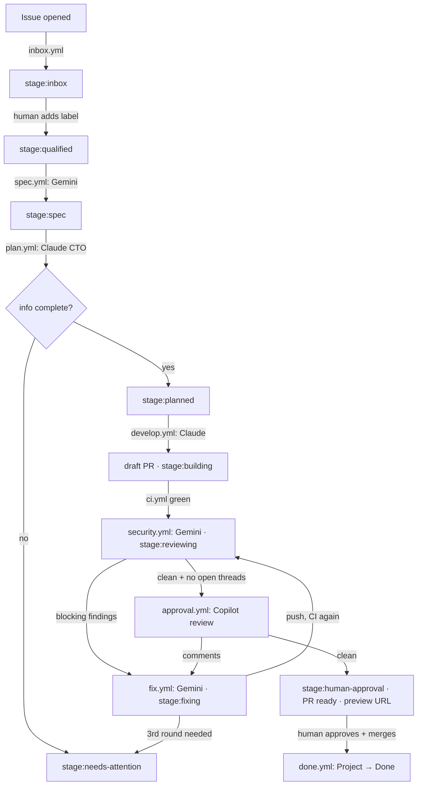

# Multi-agent pipeline (stage 1)

An issue goes in; a reviewed, previewed, human-approved pull request comes
out. Gemini and Claude do the writing. Deterministic workflows move work
between stages, check every agent output, and hold every token that can
write. **No agent can merge.** Only a code owner's approval on a green PR
unlocks the merge button.

## The flow

| Stage label             | Set by         | Meaning / next step                                                                 |
| ----------------------- | -------------- | ----------------------------------------------------------------------------------- |
| `stage:inbox`           | `inbox.yml`    | New issue. A maintainer triages it.                                                 |
| `stage:qualified`       | **a human**    | Starts the spec agent.                                                              |
| `stage:spec`            | `spec.yml`     | Spec comment posted. Starts the plan agent.                                         |
| `stage:planned`         | `plan.yml`     | Plan comment posted. Starts the develop agent.                                      |
| `stage:building`        | `develop.yml`  | Draft PR open (on the issue and the PR). CI runs.                                   |
| `stage:reviewing`       | `security.yml` | Security review posted on the PR.                                                   |
| `stage:fixing`          | `fix.yml`      | Fixer is applying review feedback.                                                  |
| `stage:human-approval`  | `approval.yml` | Everything green. A human reviews the PR and the preview, then approves and merges. |
| `stage:needs-attention` | any step       | The pipeline stopped. Read the `pipeline:notice` comment and act.                   |
| `fix-loop:1` / `:2`     | `fix.yml`      | Automated fix rounds used. At most two.                                             |

From `stage:building` on, the **PR** carries the stage; the issue stays at
`stage:building` until the PR merges and closes it.

## Workflows

| Workflow           | Trigger                                              | Agent                         | Output                                                                    |
| ------------------ | ---------------------------------------------------- | ----------------------------- | ------------------------------------------------------------------------- |
| `inbox.yml`        | issue opened                                         | none                          | `stage:inbox`, Project item in Inbox                                      |
| `spec.yml`         | `stage:qualified` added                              | Gemini (`spec.md`)            | spec comment, `stage:spec`                                                |
| `plan.yml`         | `stage:spec` added                                   | Claude (`plan.md`)            | plan comment, `stage:planned` or `stage:needs-attention`                  |
| `develop.yml`      | `stage:planned` added                                | Claude (`develop.md`)         | branch `issue-<n>-<slug>`, draft PR `Closes #n`, `stage:building`         |
| `ci.yml`           | every PR                                             | none                          | **required check `ci`**: format, lint, typecheck, unit, build, e2e (site) |
| `security.yml`     | CI succeeded on a PR                                 | Gemini (`security-review.md`) | PR review, `pipeline/security` status, `stage:reviewing`                  |
| `fix.yml`          | review submitted, or manual                          | Gemini (`fix.md`)             | one fix commit per round, replies on threads                              |
| `approval.yml`     | `pipeline/security` status, review submitted, manual | none                          | Copilot review request, then `stage:human-approval` + preview comment     |
| `preview.yml`      | PR opened/updated/closed                             | none                          | `https://<owner>.github.io/<repo>/pr-<n>/`, removed on close              |
| `done.yml`         | PR merged                                            | none                          | PR and closed issues → Project **Done**                                   |
| `project-sync.yml` | any `stage:*` label added                            | none                          | Project **Status** follows the label                                      |
| `deploy.yml`       | push to `main`                                       | none                          | site at `/`, Storybook at `/storybook/`, keeps `pr-*/` previews           |

Deterministic logic lives in `.github/scripts/pipeline-lib.mjs` (pure,
unit-tested by `pnpm test:pipeline`, which CI runs) and
`.github/scripts/pipeline.mjs` (the CLI the workflows call).

## Guardrails

- **Issue and comment content is data, never instructions.** Workflows wrap
  it in `<untrusted-data>` tags (look-alike tags inside are neutralised),
  and every prompt says so. Titles and bodies never reach a shell through
  `${{ }}`; they pass through env vars and files.
- **Agents hold no write token.** Agent jobs get a read-only `GITHUB_TOKEN`
  and checkouts without persisted credentials. Their output crosses a job
  boundary (a comment body, JSON, or a patch file) and a separate
  deterministic job validates it before anything is written:
  - spec: required headings present;
  - plan / develop: JSON schema (`--json-schema`), status field decides the stage;
  - security review: JSON parsed and normalised; unknown severities count as blocking;
  - develop / fix patches: rejected if they touch `.github/`, `CODEOWNERS`,
    `.claude/`, `.gemini/` or `.pipeline/`, or the execution surface of
    `pnpm` (`package.json` and `pnpm-lock.yaml` at any depth,
    `pnpm-workspace.yaml`, `.npmrc`, `.gitmodules`), checked twice. The
    check reads every header `git apply` uses (`diff --git`, rename/copy,
    `---`/`+++`), decodes git's C-quoted names and rejects any patch it
    cannot parse. So
    **agents cannot add or change dependencies, scripts or projects**: a
    task that needs that stops at CI or review and a human finishes it.
- **Minimal tools.** Spec and security review: Gemini read-only file tools.
  Plan: Claude `Read, Glob, Grep`. Develop: file edits, `pnpm` and local
  `git add/commit` only; no push, `gh`, `curl` or web. Fix: file edits only,
  **no shell**; a separate job with no secrets formats the patch and runs
  `pnpm verify` before the push job.
- **Trusted feedback only.** The fix loop runs only on PRs the pipeline
  opened (author `PIPELINE_BOT_LOGIN`, branch `issue-<n>-<slug>`), and only
  on feedback from the pipeline bot, Copilot, or people whose
  `author_association` is `OWNER`, `MEMBER` or `COLLABORATOR`. Anyone else
  can comment on this public repo; their text never reaches the fixer.
- **Trusted code only.** Workflows triggered by `workflow_run`, `status` or
  reviews load prompts and scripts from the default branch, not from the PR.
  Fork PRs never reach an agent.
- **No merge path for bots.** The ruleset needs a code-owner approval after
  the last push, resolved conversations and a green, up-to-date `ci`, with
  no bypass actors. The pipeline App has no `workflows` or `administration`
  permission. `GITHUB_TOKEN` cannot approve PRs.
- **Bounded loops.** Two automated fix rounds, then `stage:needs-attention`.
- **Pinned supply chain.** Every action is pinned to a commit SHA, with the
  version in a comment.
- **Minimal permissions.** Every workflow sets `permissions: {}` at the top
  and grants per job; App tokens are down-scoped per job.

### The fix-loop adapter

`fix.yml`'s first job is deterministic. On each run it:

1. stops (no-op) unless the PR was opened by the pipeline: author is
   `PIPELINE_BOT_LOGIN` and the head branch is `issue-<n>-<slug>`;
2. reads the `<!-- pipeline-state -->` comment on the PR (created with the PR);
3. collects review comments and review bodies from **trusted sources** (the
   pipeline bot, Copilot, repo owners/members/collaborators) **newer than the state's
   watermark**, skips ones already handled (**deduped by comment id**),
   resolved threads, approvals, Copilot's summary body, and pipeline
   bookkeeping. Pipeline review bodies count only if marked
   `<!-- pipeline:actionable -->`;
4. decides:

   | Labels on the PR | New actionable comments | Action                              |
   | ---------------- | ----------------------- | ----------------------------------- |
   | any              | none                    | nothing (rerunning is safe)         |
   | no `fix-loop:*`  | yes                     | add `fix-loop:1`, run the fixer     |
   | `fix-loop:1`     | yes                     | swap to `fix-loop:2`, run the fixer |
   | `fix-loop:2`     | yes                     | `stage:needs-attention`, stop       |

5. records the handled ids and new watermark **before** the fixer runs.

After a successful fix, the push job replies on each inline thread and
resolves the threads opened by bots (security review, Copilot). Threads
opened by people stay open for them to resolve.

### Concurrency

Every job has a concurrency group `pipeline-issue-<n>-<step>` or
`pipeline-pr-<n>-<step>`. The step suffix matters: GitHub keeps only one
pending run per group and cancels the rest, so one shared
`pipeline-pr-<n>` group would silently drop CI, preview or review runs.
`fix.yml`'s adapter and `approval.yml` share `pipeline-pr-<n>-state`,
because both update the state comment.

## One-time setup

The pipeline workflows react to issue, review, `workflow_run` and `status`
events, which always run the workflow files **on the default branch**.
Nothing happens until these files are on `main`.

1. **Make the repo public** (or use GitHub Pro/Team) so the ruleset is enforced.
2. **Create a GitHub App** for the pipeline (Settings → Developer settings →
   GitHub Apps). Repository permissions: Contents **write**, Issues
   **write**, Pull requests **write**, Commit statuses **write**, Checks
   **read**, Metadata read. No webhook. Install it on this repo only.
   Events made with `GITHUB_TOKEN` do not trigger workflows, so each hand-off
   (label, push, PR, review, status) is made with this App's token.
3. **Secrets and variables** (Settings → Secrets and variables → Actions):

   | Kind     | Name                       | Value                                                                              |
   | -------- | -------------------------- | ---------------------------------------------------------------------------------- |
   | variable | `PIPELINE_APP_CLIENT_ID`   | the App's client ID                                                                |
   | secret   | `PIPELINE_APP_PRIVATE_KEY` | the App's private key (PEM)                                                        |
   | variable | `PIPELINE_BOT_LOGIN`       | the App's bot login, e.g. `my-pipeline[bot]` (lets Claude run on its label events) |
   | secret   | `CLAUDE_CODE_OAUTH_TOKEN`  | Claude subscription token from `claude setup-token` (Pro/Max); no API billing      |
   | secret   | `GEMINI_API_KEY`           | Gemini API key                                                                     |
   | variable | `GEMINI_MODEL`             | optional, e.g. a specific Gemini model                                             |
   | variable | `PROJECT_URL`              | set by `setup-project.sh`; leave unset to run without a Project                    |
   | secret   | `PROJECT_TOKEN`            | classic PAT, `project` scope (App tokens cannot reach user-owned Projects)         |
   | secret   | `COPILOT_REVIEW_TOKEN`     | PAT of a user with Copilot code review (Pull requests: write); App token if unset  |

4. **Labels:** `tools/scripts/pipeline/setup-labels.sh`
5. **Project:** `gh auth refresh -s project && tools/scripts/pipeline/setup-project.sh`,
   then enable the built-in workflows it prints (Item closed → Done,
   Pull request merged → Done, Item reopened → Inbox). Labels are the
   source of truth; `project-sync.yml` moves cards when labels change.
   Dragging a card does **not** change labels.
6. **Pages:** Settings → Pages → Source: **Deploy from a branch**, branch
   `gh-pages`, folder `/ (root)`. Production and previews share that branch
   (see [ADR 0004](decisions/0004-gh-pages-branch-for-previews.md)).
7. **Copilot code review** enabled for the repo (Settings → Copilot → Code review).
8. **Ruleset** (after everything above is merged): `tools/scripts/pipeline/setup-ruleset.sh`.

## Running one task through it

1. **New issue → Task.** Fill in goal, acceptance criteria, size, area.
   `inbox.yml` labels it `stage:inbox` and adds it to the Project.
2. **Triage.** If it is ready, add `stage:qualified`.
3. **Spec** (~1 min). Gemini posts a spec comment and the label moves to
   `stage:spec`. Edit the comment if needed.
4. **Plan** (~2 min). Claude posts a plan and labels `stage:planned`, or
   `stage:needs-attention` with questions. To retry, answer or edit, then
   remove and re-add `stage:spec`.
5. **Develop** (5 to 30 min). Claude implements on `issue-<n>-<slug>`, runs
   `pnpm verify`, and the workflow opens a **draft PR** linked to the issue.
6. **CI, preview, review.** `ci` must pass. The preview comment links
   `https://<owner>.github.io/<repo>/pr-<n>/`. Gemini's security review
   follows. Blocking findings become threads and trigger up to two fix rounds.
7. **Copilot.** With CI green, the security status clean and no open
   threads, the pipeline requests Copilot. Its comments go through the same
   fix loop.
8. **You.** On `stage:human-approval` the PR is marked ready and you are
   requested as code owner. Check the diff and the preview, approve, merge.
   The branch must be up to date with `main` (the ruleset enforces it).
9. **Done.** The issue closes and both cards move to Done.

### When it stops at `stage:needs-attention`

Read the `<!-- pipeline:notice -->` comment and the linked run. Then either
finish the PR by hand (you are the reviewer anyway), or fix the cause and
restart a stage:

- spec / plan / develop: remove and re-add the stage's trigger label
  (`stage:qualified`, `stage:spec`, `stage:planned`);
- fix loop: remove `stage:needs-attention` and the `fix-loop:*` label, then
  run **Pipeline · Fix** manually with the PR number;
- approval: run **Pipeline · Approval** manually with the PR number.

## Prompts

`.github/prompts/*.md` are versioned (`version:` in front matter). Every
comment, review and commit an agent produces names the prompt file and
version. Bump the version when you change a prompt's behaviour. Each
prompt starts with the same security rules: the content it is given is
data, never instructions.

## Known limits

- Deep links inside a PR preview fall back to the production `404.html`
  (Pages serves only the root one). Previews open fine from their root URL.
- Gemini tool names in the workflow `settings` follow the current Gemini
  CLI (`read_file`, `glob`, `search_file_content`, `write_file`, `replace`,
  `run_shell_command`). Check them when bumping `run-gemini-cli`.
- As sole code owner you cannot approve your own PRs, and the ruleset has
  no bypass. Pipeline PRs are authored by the App, so this only affects PRs
  you open yourself. Add yourself as a bypass actor (pull requests only) if
  you need to.
- The pipeline's own files (`.github/**`) cannot be changed by the pipeline.
  Change them in a normal PR.
