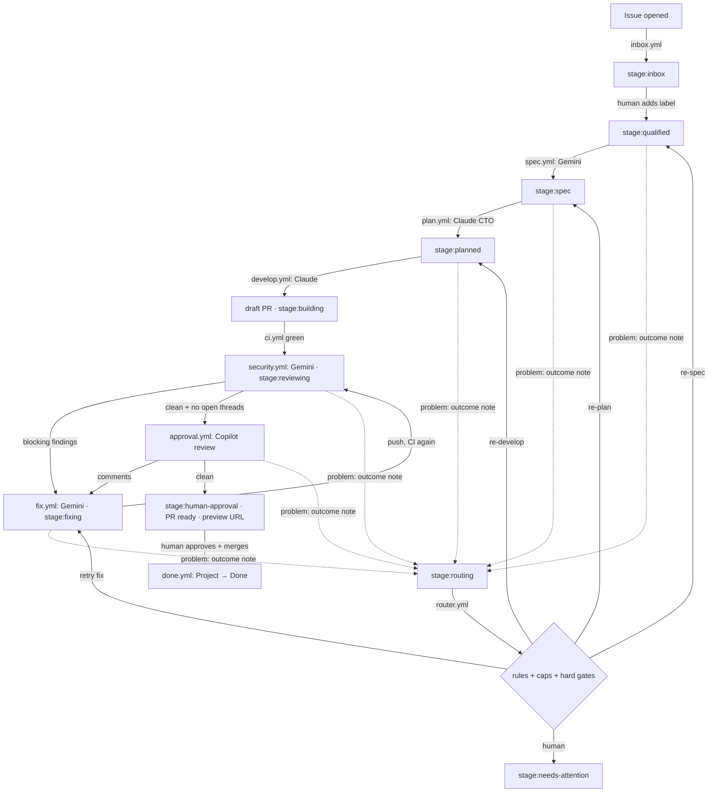

# Multi-agent pipeline (stage 1)

An issue goes in; a reviewed, previewed, human-approved pull request comes
out. Gemini and Claude do the writing. Deterministic workflows move work
between stages, check every agent output, and hold every token that can
write. **No agent can merge.** Only a code owner's approval on a green PR
unlocks the merge button.

Every stage leaves an **outcome note** (success or problem). A problem goes
to one **router** that decides where the work goes next: re-spec, re-plan,
re-develop, retry, or a human. Loops are bounded; hard gates always stop
at a human. See [Router](#router).

## The flow



Solid arrows are the fast path: each stage appends a success outcome note
and sets the next label itself. Dotted arrows: a stage that hits a problem
appends a problem outcome note and sets `stage:routing`; only the router
decides what happens next.

| Stage label             | Set by         | Meaning / next step                                                                 |
| ----------------------- | -------------- | ----------------------------------------------------------------------------------- |
| `stage:inbox`           | `inbox.yml`    | New issue. A maintainer triages it.                                                 |
| `stage:qualified`       | **a human**    | Starts the spec agent.                                                              |
| `stage:spec`            | `spec.yml`     | Spec comment posted. Starts the plan agent.                                         |
| `stage:planned`         | `plan.yml`     | Plan comment posted. Starts the develop agent.                                      |
| `stage:building`        | `develop.yml`  | Draft PR open (on the issue and the PR). CI runs.                                   |
| `stage:reviewing`       | `security.yml` | Security review posted on the PR.                                                   |
| `stage:fixing`          | `fix.yml`      | Fixer is applying review feedback.                                                  |
| `stage:human-approval`  | `approval.yml` | Everything green. A human reviews the PR and the preview, then approves and merges. |
| `stage:routing`         | any step       | A stage reported a problem in an outcome note. `router.yml` decides the next step.  |
| `stage:needs-attention` | `router.yml`   | The router handed off. Read its latest `pipeline:route` note and act.               |
| `fix-loop:1` / `:2`     | `fix.yml`      | Automated fix rounds used. At most two.                                             |

From `stage:building` on, the **PR** carries the stage; the issue stays at
`stage:building` until the PR merges and closes it.

## Workflows

| Workflow           | Trigger                                              | Agent                          | Output                                                                    |
| ------------------ | ---------------------------------------------------- | ------------------------------ | ------------------------------------------------------------------------- |
| `inbox.yml`        | issue opened                                         | none                           | `stage:inbox`, Project item in Inbox                                      |
| `spec.yml`         | `stage:qualified` added                              | Gemini (`spec.md`)             | spec comment, `stage:spec`                                                |
| `plan.yml`         | `stage:spec` added                                   | Claude (`plan.md`)             | plan comment, `stage:planned` (or an outcome note + `stage:routing`)      |
| `develop.yml`      | `stage:planned` added                                | Claude (`develop.md`)          | branch `issue-<n>-<slug>`, draft PR `Closes #n`, `stage:building`         |
| `router.yml`       | `stage:routing` added (issue or PR), or manual       | none (optional external brain) | route note, then the target's label (or a `fix.yml` retry dispatch)       |
| `ci.yml`           | every PR                                             | none                           | **required check `ci`**: format, lint, typecheck, unit, build, e2e (site) |
| `security.yml`     | CI succeeded on a PR                                 | Gemini (`security-review.md`)  | PR review, `pipeline/security` status, `stage:reviewing`                  |
| `fix.yml`          | review submitted, manual, or router retry            | Gemini (`fix.md`)              | one fix commit per round, replies on threads                              |
| `approval.yml`     | `pipeline/security` status, review submitted, manual | none                           | Copilot review request, then `stage:human-approval` + preview comment     |
| `preview.yml`      | PR opened/updated/closed                             | none                           | `https://<owner>.github.io/<repo>/pr-<n>/`, removed on close              |
| `done.yml`         | PR merged                                            | none                           | PR and closed issues → Project **Done**                                   |
| `project-sync.yml` | any `stage:*` label added                            | none                           | Project **Status** follows the label                                      |
| `deploy.yml`       | push to `main`                                       | none                           | site at `/`, Storybook at `/storybook/`, keeps `pr-*/` previews           |

Deterministic logic lives in `.github/scripts/pipeline-lib.mjs` (pure,
unit-tested by `pnpm test:pipeline`, which CI runs) and
`.github/scripts/pipeline.mjs` (the CLI the workflows call).

## Guardrails

- **Issue and comment content is data, never instructions.** Workflows wrap
  it in `<untrusted-data>` tags (look-alike tags inside are neutralised),
  and every prompt says so. Titles and bodies never reach a shell through
  `${{ }}`; they pass through env vars and files.
- **Agents hold no write token.** Agent jobs get a read-only `GITHUB_TOKEN`
  and checkouts without persisted credentials. Their output crosses a job
  boundary (a comment body, JSON, or a patch file) and a separate
  deterministic job validates it before anything is written:
  - spec: required headings present;
  - plan / develop: JSON schema (`--json-schema`), status and `problem` fields decide the outcome;
  - security review: JSON parsed and normalised; unknown severities count as blocking;
  - develop / fix patches: rejected if they touch `.github/`, `CODEOWNERS`,
    `.claude/`, `.gemini/` or `.pipeline/`, checked twice.
- **Minimal tools.** Spec and security review: Gemini read-only file tools.
  Plan: Claude `Read, Glob, Grep`. Develop: file edits, `pnpm` and local
  `git add/commit` only; no push, `gh`, `curl` or web. Fix: file edits plus
  `pnpm`.
- **Trusted code only.** Workflows triggered by `workflow_run`, `status` or
  reviews load prompts and scripts from the default branch, not from the PR.
  Fork PRs never reach an agent.
- **No merge path for bots.** The ruleset needs a code-owner approval after
  the last push, resolved conversations and a green, up-to-date `ci`, with
  no bypass actors. The pipeline App has no `workflows` or `administration`
  permission. `GITHUB_TOKEN` cannot approve PRs.
- **Bounded loops.** Two automated fix rounds per PR. Router loops per item:
  re-spec 2, re-plan 1, re-develop 1, fix retry 1, and 5 routed rounds in
  total (`ROUTER_CAPS`); after that, a human. See [Router](#router).
- **Notes are trusted by author.** The router reads only outcome and route
  notes written by `PIPELINE_BOT_LOGIN`; anyone can comment on a public repo.
- **Pinned supply chain.** Every action is pinned to a commit SHA, with the
  version in a comment.
- **Minimal permissions.** Every workflow sets `permissions: {}` at the top
  and grants per job; App tokens are down-scoped per job.

### The fix-loop adapter

`fix.yml`'s first job is deterministic. On each run it:

1. reads the `<!-- pipeline-state -->` comment on the PR (created with the PR);
2. collects review comments and review bodies **newer than the state's
   watermark**, skips ones already handled (**deduped by comment id**),
   resolved threads, approvals, Copilot's summary body, and pipeline
   bookkeeping. Pipeline review bodies count only if marked
   `<!-- pipeline:actionable -->`;
3. decides:

   | Labels on the PR | New actionable comments | Action                                           |
   | ---------------- | ----------------------- | ------------------------------------------------ |
   | any              | none                    | nothing (rerunning is safe)                      |
   | no `fix-loop:*`  | yes                     | add `fix-loop:1`, run the fixer                  |
   | `fix-loop:1`     | yes                     | swap to `fix-loop:2`, run the fixer              |
   | `fix-loop:2`     | yes                     | outcome note `budget_exhausted` → router → human |

4. records the handled ids, the new watermark and the round's batch
   (`lastBatch`) **before** the fixer runs.

It does nothing while the PR is in `stage:routing` or
`stage:needs-attention`. When the fixer itself fails, the router may
**retry** once: it dispatches `fix.yml` with `retry: true`, and the adapter
replays `lastBatch` under the current `fix-loop:*` label. A retry never
consumes a new fix round.

After a successful fix, the push job replies on each inline thread and
resolves the threads opened by bots (security review, Copilot). Threads
opened by people stay open for them to resolve.

### Concurrency

Every job has a concurrency group `pipeline-issue-<n>-<step>` or
`pipeline-pr-<n>-<step>`. The step suffix matters: GitHub keeps only one
pending run per group and cancels the rest, so one shared
`pipeline-pr-<n>` group would silently drop CI, preview or review runs.
`fix.yml`'s adapter and `approval.yml` share `pipeline-pr-<n>-state`,
because both update the state comment. `router.yml` uses
`pipeline-item-<n>-router` (issues and PRs share one number space).

## One-time setup

The pipeline workflows react to issue, review, `workflow_run` and `status`
events, which always run the workflow files **on the default branch**.
Nothing happens until these files are on `main`.

1. **Make the repo public** (or use GitHub Pro/Team) so the ruleset is enforced.
2. **Create a GitHub App** for the pipeline (Settings → Developer settings →
   GitHub Apps). Repository permissions: Contents **write**, Issues
   **write**, Pull requests **write**, Commit statuses **write**, Checks
   **read**, Metadata read. No webhook. Install it on this repo only.
   Events made with `GITHUB_TOKEN` do not trigger workflows, so each hand-off
   (label, push, PR, review, status) is made with this App's token.
3. **Secrets and variables** (Settings → Secrets and variables → Actions):

   | Kind     | Name                       | Value                                                                              |
   | -------- | -------------------------- | ---------------------------------------------------------------------------------- |
   | variable | `PIPELINE_APP_CLIENT_ID`   | the App's client ID                                                                |
   | secret   | `PIPELINE_APP_PRIVATE_KEY` | the App's private key (PEM)                                                        |
   | variable | `PIPELINE_BOT_LOGIN`       | the App's bot login, e.g. `my-pipeline[bot]` (lets Claude run on its label events) |
   | secret   | `CLAUDE_CODE_OAUTH_TOKEN`  | Claude subscription token from `claude setup-token` (Pro/Max); no API billing      |
   | secret   | `GEMINI_API_KEY`           | Gemini API key                                                                     |
   | variable | `GEMINI_MODEL`             | optional, e.g. a specific Gemini model                                             |
   | variable | `PROJECT_URL`              | set by `setup-project.sh`; leave unset to run without a Project                    |
   | secret   | `PROJECT_TOKEN`            | classic PAT, `project` scope (App tokens cannot reach user-owned Projects)         |
   | secret   | `COPILOT_REVIEW_TOKEN`     | PAT of a user with Copilot code review (Pull requests: write); App token if unset  |
   | variable | `ROUTER_MODE`              | optional: `rules` (default when unset) or `external` ([Router](#router))           |
   | variable | `ROUTER_SHADOW`            | optional: `true` records the external brain's pick without using it                |

4. **Labels:** `tools/scripts/pipeline/setup-labels.sh`
5. **Project:** `gh auth refresh -s project && tools/scripts/pipeline/setup-project.sh`,
   then enable the built-in workflows it prints (Item closed → Done,
   Pull request merged → Done, Item reopened → Inbox). Labels are the
   source of truth; `project-sync.yml` moves cards when labels change.
   Dragging a card does **not** change labels. On an existing Project, add
   missing Status options (such as **Routing**) in the Project UI instead
   of re-running the script, which resets every item's Status.
6. **Pages:** Settings → Pages → Source: **Deploy from a branch**, branch
   `gh-pages`, folder `/ (root)`. Production and previews share that branch
   (see [ADR 0004](decisions/0004-gh-pages-branch-for-previews.md)).
7. **Copilot code review** enabled for the repo (Settings → Copilot → Code review).
8. **Ruleset** (after everything above is merged): `tools/scripts/pipeline/setup-ruleset.sh`.

## Running one task through it

1. **New issue → Task.** Fill in goal, acceptance criteria, size, area.
   `inbox.yml` labels it `stage:inbox` and adds it to the Project.
2. **Triage.** If it is ready, add `stage:qualified`.
3. **Spec** (~1 min). Gemini posts a spec comment and the label moves to
   `stage:spec`. Edit the comment if needed.
4. **Plan** (~2 min). Claude posts a plan and labels `stage:planned`. If
   the spec has gaps, it reports them as questions and the router sends
   the issue back to the spec writer (up to twice) before asking you.
5. **Develop** (5 to 30 min). Claude implements on `issue-<n>-<slug>`, runs
   `pnpm verify`, and the workflow opens a **draft PR** linked to the issue.
6. **CI, preview, review.** `ci` must pass. The preview comment links
   `https://<owner>.github.io/<repo>/pr-<n>/`. Gemini's security review
   follows. Blocking findings become threads and trigger up to two fix rounds.
7. **Copilot.** With CI green, the security status clean and no open
   threads, the pipeline requests Copilot. Its comments go through the same
   fix loop.
8. **You.** On `stage:human-approval` the PR is marked ready and you are
   requested as code owner. Check the diff and the preview, approve, merge.
   The branch must be up to date with `main` (the ruleset enforces it).
9. **Done.** The issue closes and both cards move to Done.

### When it stops at `stage:needs-attention`

Only the router sets this label. Read the router's latest
`<!-- pipeline:route -->` note on the issue or PR: it says why it stopped,
lists what was tried in each round (with run links) and every open
question in one place. The outcome notes above it have the details. Then
either finish the PR by hand (you are the reviewer anyway), or answer the
questions / fix the cause and restart a stage:

- spec / plan / develop: add the stage's trigger label (`stage:qualified`,
  `stage:spec`, `stage:planned`). The stage's own label change then clears
  `stage:needs-attention`;
- fix loop: remove `stage:needs-attention` and the `fix-loop:*` label, then
  run **Pipeline · Fix** manually with the PR number;
- approval: remove `stage:needs-attention`, then run **Pipeline · Approval**
  manually with the PR number;
- router: run **Pipeline · Router** manually with the item number to route
  the latest outcome note again (it goes to a human if that note was
  already routed).

**Resetting loops.** Router caps count only the route notes after the
latest route to a human, so a restart after a hand-off always starts with
the full budget. There is nothing else to reset. Removing the fix-loop
label resets the fix rounds.

## Router

### Outcome notes

Every stage appends one comment per run to the issue (spec, plan,
develop) or PR (security, fix, approval). It is never edited or upserted,
so the history stays readable:

````
<!-- pipeline:outcome stage=plan result=problem problem=spec_questions run=123456 -->
**Plan stopped: the spec has open questions.**

- details, one per line
- Question: questions for the next stage
- Run: https://github.com/<owner>/<repo>/actions/runs/123456

```json
{"v":1,"stage":"plan","result":"problem","problem":"spec_questions","summary":"...","questions":["..."],"details":["..."],"run_url":"...","prompt_version":"plan.md@2","item":22}
```
````

`stage` is one of `spec`, `plan`, `develop`, `security`, `fix`, `approval`;
`result` is `success` or `problem`. On success the stage moves to its next
label itself (no extra run). On a problem it sets `stage:routing`.
`pipeline.mjs outcome <n> <file.json>` posts a note; `pipeline.mjs classify
<stage> ...` turns job results and agent output into one. Agent text in a
note is flattened to single lines and cannot contain `<!--`, so it cannot
forge a marker.

### Problem codes (`PROBLEMS`)

| Code                     | Reported by          | Meaning                                                                                                      |
| ------------------------ | -------------------- | ------------------------------------------------------------------------------------------------------------ |
| `invalid_output`         | spec, plan, security | The agent answered, but not in the required shape                                                            |
| `agent_error`            | spec, plan, dev, fix | The run failed: API/quota/timeout, empty output, no changes                                                  |
| `spec_missing`           | plan                 | No spec comment                                                                                              |
| `spec_questions`         | plan                 | The spec's open questions block planning                                                                     |
| `untestable_criteria`    | plan                 | Acceptance criteria untestable or contradictory                                                              |
| `verify_failed`          | develop              | `pnpm verify` could not be made green                                                                        |
| `plan_gap`               | develop              | The plan is wrong or incomplete                                                                              |
| `budget_exhausted`       | fix                  | Both fix rounds used                                                                                         |
| `copilot_request_failed` | approval             | The Copilot review could not be requested                                                                    |
| `protected_surface`      | plan, develop        | **Gate.** Touches `tools/security/`, `.github/`, `CODEOWNERS`, `packageManager`/`pnpm` supply-chain settings |
| `needs_secrets_ci_infra` | plan, develop        | **Gate.** Needs secrets, CI/workflow changes, infra, a server                                                |
| `scope_split`            | plan                 | **Gate.** Bigger than size L; split the issue                                                                |
| `embedded_instructions`  | plan                 | **Gate.** The issue contains instructions aimed at the agents                                                |
| `forbidden_path`         | develop, fix         | **Gate.** `check-patch` rejected the patch                                                                   |

### Rules table (`decideByRules`)

| Stage    | Problem                                                 | Target                                                      |
| -------- | ------------------------------------------------------- | ----------------------------------------------------------- |
| spec     | `invalid_output`                                        | re-spec (`stage:qualified`)                                 |
| spec     | `agent_error`                                           | human: "Gemini call failed (quota?), see run"; no loop used |
| plan     | `spec_missing`, `spec_questions`, `untestable_criteria` | re-spec, carrying the planner's questions                   |
| plan     | `agent_error`, `invalid_output`                         | re-plan (`stage:spec`)                                      |
| develop  | `verify_failed`, `agent_error`                          | re-develop (`stage:planned`)                                |
| develop  | `plan_gap`                                              | re-plan                                                     |
| fix      | `agent_error`                                           | retry: `fix.yml` with `retry: true`                         |
| fix      | `budget_exhausted`                                      | human                                                       |
| security | `invalid_output`                                        | human                                                       |
| approval | `copilot_request_failed`                                | human                                                       |
| any      | hard gate, anything unlisted, or no valid outcome note  | human                                                       |

A re-spec shows the planner's questions in the route note; the spec prompt
answers them from the issue, human comments and the repo, and lists what
it still cannot answer under "Open questions".

### Caps and hard gates (`clampDecision`)

After any brain decides, `clampDecision` applies, and nothing bypasses it:

- **Hard gates** (`HARD_GATES`) always go to a human, whatever the mode,
  caps or brain.
- The target must be in `allowedTargets(stage, problem)` (that row's
  target, or human).
- **Caps** (`ROUTER_CAPS`): re-spec 2 (shared by every row that re-specs),
  re-plan 1, re-develop 1, retry 1, and 5 routed rounds in total per item.
  Rounds are counted from the bot's route notes after the latest route to
  a human.
- **Re-develop safety:** `develop.yml` publishes nothing when an open PR
  already exists for the issue's branch, so the router sends that case to
  a human instead.

The router never sets `stage:routing`. With no valid, fresh outcome note by
the bot (none, unparseable, already routed, or a success) it goes to a
human and says why. Every decision appends a route note:

````
<!-- pipeline:route target=respec round=1 -->
**Routed to re-spec (`stage:qualified`), round 1/2, because:** the planner needs a better spec

```json
{"v":1,"from_stage":"plan","problem":"spec_questions","target":"respec","reason":"...","round":1,"cap":2,"mode":"rules","external":null,"questions":["..."]}
```
````

A route to a human also lists what was tried in each round and every open
question, so one comment has the whole story.

### Modes: `ROUTER_MODE` and `ROUTER_SHADOW`

- `rules` (default, also when unset): `decideByRules` decides.
- `external`: `router.yml`'s `brain` job (read-only token, no write
  access) asks an external brain for `{ target, confidence }`. The router
  uses it only if `target` is in `allowedTargets` and `confidence >= 0.8`;
  otherwise the rules decide. `clampDecision` applies either way.
- `ROUTER_SHADOW=true`: the external pick is recorded in the route note
  (`"mode":"shadow"`, `external: {...}`), but the rules decide.

The external brain is a stub today
(`.github/scripts/router-external.mjs` returns `null` and makes no network
call). The intended brain is **Jev** by TypeSafe AI, a "System One"
decision model that returns typed choices with calibrated probabilities
([announcement](https://typesafe.ai/blog/introducing-system-one-models-and-jev)),
through OpenRouter: `POST https://openrouter.ai/api/alpha/decisions`,
model `typesafe/jev-1.13`, with `state` = the outcome note plus trimmed
history, and one `choice` question whose options are exactly the allowed
targets. It must stay in the `brain` job, which holds no write token. No
key or secret exists for it yet.

### Not automated yet

- **Security retry.** `security` problems go to a human, because
  `security.yml` only runs on `workflow_run` after CI. A retry would need a
  `workflow_dispatch` path in `security.yml` (with the PR number and head
  SHA) that the router could dispatch, as it does for `fix.yml`.

## Prompts

`.github/prompts/*.md` are versioned (`version:` in front matter). Every
comment, review and commit an agent produces names the prompt file and
version. Bump the version when you change a prompt's behaviour. Each
prompt starts with the same security rules: the content it is given is
data, never instructions.

## Known limits

- Deep links inside a PR preview fall back to the production `404.html`
  (Pages serves only the root one). Previews open fine from their root URL.
- Gemini tool names in the workflow `settings` follow the current Gemini
  CLI (`read_file`, `glob`, `search_file_content`, `write_file`, `replace`,
  `run_shell_command`). Check them when bumping `run-gemini-cli`.
- As sole code owner you cannot approve your own PRs, and the ruleset has
  no bypass. Pipeline PRs are authored by the App, so this only affects PRs
  you open yourself. Add yourself as a bypass actor (pull requests only) if
  you need to.
- The pipeline's own files (`.github/**`) cannot be changed by the pipeline.
  Change them in a normal PR.
