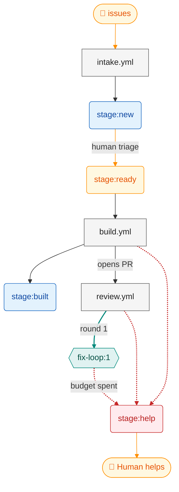

# Pipeline map

<!-- Generated by tools/pipeline-map, do not edit by hand. -->

> Generated by `tools/pipeline-map`, do not edit by hand. Regenerate with `pnpm pipeline:map`; `pnpm verify` fails when this file is stale.

Every path through the issue → PR pipeline, derived from `.github/workflows/*.yml` and the `STAGES`, `MARKERS`, `FIX_LOOP_*` and `COMMAND_EFFECTS` exports of `.github/scripts/pipeline-lib.mjs`. The prose lives in [pipeline.md](pipeline.md).

## Map

Blue: stage labels. Grey: workflows; an arrow from a label into a workflow is its label gate. Red, dashed: escalations to a problem stage. Amber: humans. Teal: the fix loop.

## Workflows

| Workflow     | Trigger           | Gate (job `if:`) | Stages set                               | Comment markers    |
| ------------ | ----------------- | ---------------- | ---------------------------------------- | ------------------ |
| `build.yml`  | `issues: labeled` | `stage:ready`    | `stage:built`, `stage:help` (escalation) | `notice`, `result` |
| `intake.yml` | `issues`          | -                | `stage:new`                              | -                  |
| `review.yml` | `pull_request`    | -                | `stage:help` (escalation)                | `notice`, `result` |

## Comment markers

| Marker                 | Key      | Written by (workflow, `pipeline.mjs` command)                   |
| ---------------------- | -------- | --------------------------------------------------------------- |
| `<!-- demo:notice -->` | `notice` | `build.yml` (`upsert-comment`), `review.yml` (`review`)         |
| `<!-- demo:result -->` | `result` | `build.yml` (`upsert-comment`), `review.yml` (`upsert-comment`) |
| `<!-- demo:unused -->` | `unused` | -                                                               |

## Stages with no label gate, by design

From `EXPECTED_UNGATED` in `tools/pipeline-map/src/config.mjs`.

| Stage        | Kind   | Why nothing is gated on it |
| ------------ | ------ | -------------------------- |
| `stage:help` | human  | a human helps              |
| `stage:new`  | triage | waits for a human          |

## Findings

- `<!-- demo:notice -->` is written by 2 workflows: `build.yml`, `review.yml`.
- `<!-- demo:result -->` is written by 2 workflows: `build.yml`, `review.yml`.
- Markers no workflow writes: `unused`.
- `stage:ready` is never set by a workflow (a human adds it; it starts the pipeline).
- Set but never gated, and not in `EXPECTED_UNGATED`: `stage:built`. Nothing reacts to these labels.
- 2 workflows escalate straight to `stage:help`: `build.yml`, `review.yml`.
